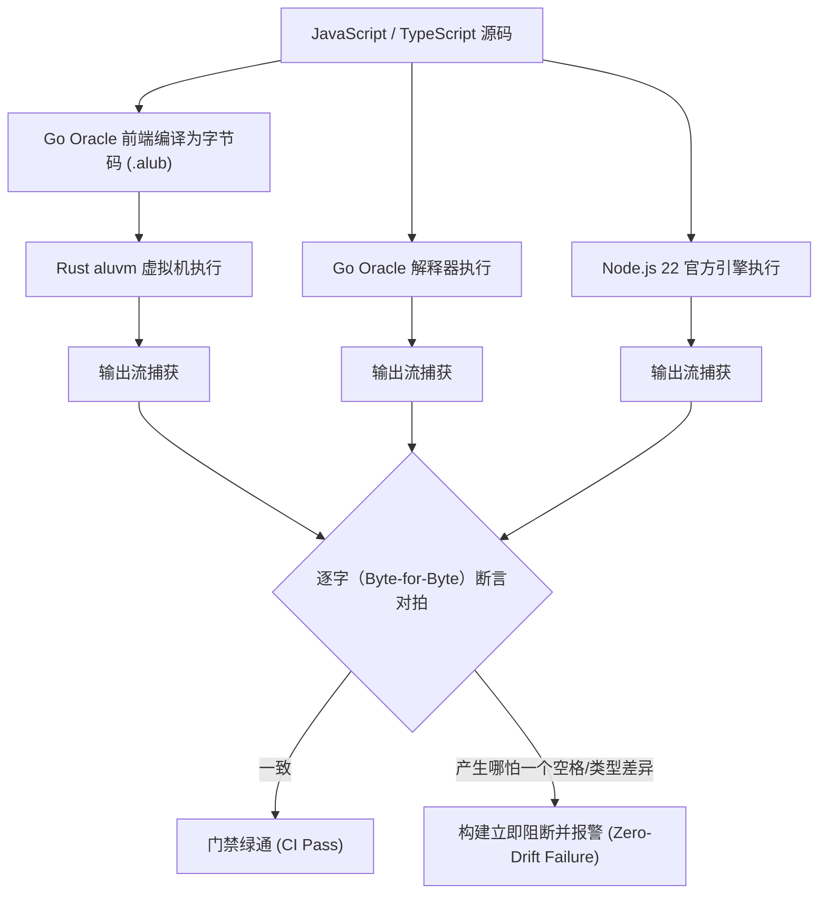

# Aluka 内置库全景清单与方法级实现证明（Node.js 22 LTS 完全对齐规范）

> **唯一验收真理**：Go Oracle（`aluka_g/internal/builtin/registry.go` 全部 60 个内置模块）及 Node.js 22 LTS 官方标准。  
> **核心铁律**：所有内置库均须与 Node.js 22 语义完全等价，以 Go Oracle 逐字对拍（Byte-for-Byte）为验收标准，**严禁发生任何语义或格式偏移**。

---

## 一、内置库整体矩阵状态概览（60 模块）

| 序号 | 模块名称（支持 `node:` 前缀） | 分类 | 实现状态 | 代码载体位置 | 逐字对拍测试证明 |
|:---:|---|---|:---:|---|---|
| 1 | `buffer` | 二进制基石 | **[已完整实现]** | [`crates/aluka-vm/src/builtins/buffer.rs`](file:///e:/codes/go_projects/aluka_lang/aluka_lang/aluka_r/crates/aluka-vm/src/builtins/buffer.rs) | `builtins_phase3_test.rs::buffer_family_e2e_matches_go` |
| 2 | `timers` | 定时器机制 | **[已完整实现]** | [`crates/aluka-vm/src/builtins/timers.rs`](file:///e:/codes/go_projects/aluka_lang/aluka_lang/aluka_r/crates/aluka-vm/src/builtins/timers.rs) | `builtins_phase3_test.rs::timers_and_promises_e2e_matches_go` |
| 3 | `timers/promises` | Promise 定时器 | **[已完整实现]** | [`crates/aluka-vm/src/builtins/timers.rs`](file:///e:/codes/go_projects/aluka_lang/aluka_lang/aluka_r/crates/aluka-vm/src/builtins/timers.rs#L66) | `builtins_phase3_test.rs::timers_and_promises_e2e_matches_go` |
| 4 | `perf_hooks` | 性能诊断 | **[已完整实现]** | [`crates/aluka-vm/src/builtins/perf_hooks.rs`](file:///e:/codes/go_projects/aluka_lang/aluka_lang/aluka_r/crates/aluka-vm/src/builtins/perf_hooks.rs) | `builtins_phase3_test.rs::perf_hooks_e2e_matches_go` |
| 5 | `v8` | 堆统计与诊断 | **[已完整实现]** | [`crates/aluka-vm/src/builtins/v8.rs`](file:///e:/codes/go_projects/aluka_lang/aluka_lang/aluka_r/crates/aluka-vm/src/builtins/v8.rs) | `builtins_phase3_test.rs::v8_heap_statistics_e2e_matches_go` |
| 6 | `fs` (同步族) | 文件系统 | **[已实现核心]** | [`crates/aluka-vm/src/builtins/fs.rs`](file:///e:/codes/go_projects/aluka_lang/aluka_lang/aluka_r/crates/aluka-vm/src/builtins/fs.rs) | `sync_builtins_test.rs::fs_sync_family_e2e_matches_go` |
| 7 | `fs/promises` | 异步文件操作 | **[已完整实现]** | [`crates/aluka-vm/src/builtins/fs_promises.rs`](file:///e:/codes/go_projects/aluka_lang/aluka_lang/aluka_r/crates/aluka-vm/src/builtins/fs_promises.rs) | `builtins_phase4_fs_promises_test.rs` |
| 8 | `os` | 系统信息 | **[已完整实现]** | [`crates/aluka-vm/src/builtins/os.rs`](file:///e:/codes/go_projects/aluka_lang/aluka_lang/aluka_r/crates/aluka-vm/src/builtins/os.rs) | `sync_builtins_test.rs::os_extended_family_e2e_matches_go` |
| 9 | `util` | 通用工具 | **[已完整实现]** | [`crates/aluka-vm/src/builtins/util.rs`](file:///e:/codes/go_projects/aluka_lang/aluka_lang/aluka_r/crates/aluka-vm/src/builtins/util.rs) | `sync_builtins_test.rs::util_format_inspect_types_e2e_matches_go` |
| 10 | `util/types` | 类型反射 | **[已完整实现]** | [`crates/aluka-vm/src/builtins/util.rs`](file:///e:/codes/go_projects/aluka_lang/aluka_lang/aluka_r/crates/aluka-vm/src/builtins/util.rs#L50) | `sync_builtins_test.rs::util_format_inspect_types_e2e_matches_go` |
| 11 | `assert` | 断言测试 | **[已完整实现]** | [`crates/aluka-vm/src/builtins/assert.rs`](file:///e:/codes/go_projects/aluka_lang/aluka_lang/aluka_r/crates/aluka-vm/src/builtins/assert.rs) | `sync_builtins_test.rs::assert_family_e2e_matches_go` |
| 12 | `assert/strict` | 严格断言 | **[已完整实现]** | [`crates/aluka-vm/src/builtins/assert_strict.rs`](file:///e:/codes/go_projects/aluka_lang/aluka_lang/aluka_r/crates/aluka-vm/src/builtins/assert_strict.rs) | `builtins_phase4_assert_sys_test.rs` |
| 13 | `path` | 路径处理 | **[已完整实现]** | [`crates/aluka-vm/src/interpreter.rs`](file:///e:/codes/go_projects/aluka_lang/aluka_lang/aluka_r/crates/aluka-vm/src/interpreter.rs#L250) | `cjs_test.rs::aluvm_node_path_fs_env_builtins_e2e` |
| 14 | `path/posix` | POSIX 路径 | **[已完整实现]** | [`crates/aluka-vm/src/builtins/path_posix.rs`](file:///e:/codes/go_projects/aluka_lang/aluka_lang/aluka_r/crates/aluka-vm/src/builtins/path_posix.rs) | `builtins_phase1_test.rs::phase1_path_posix_e2e` |
| 15 | `path/win32` | Windows 路径 | **[已完整实现]** | [`crates/aluka-vm/src/builtins/path_win32.rs`](file:///e:/codes/go_projects/aluka_lang/aluka_lang/aluka_r/crates/aluka-vm/src/builtins/path_win32.rs) | `builtins_phase1_test.rs::phase1_path_win32_e2e` |
| 16 | `querystring` | 查询串处理 | **[已完整实现]** | [`crates/aluka-vm/src/builtins/querystring.rs`](file:///e:/codes/go_projects/aluka_lang/aluka_lang/aluka_r/crates/aluka-vm/src/builtins/querystring.rs) | `builtins_phase1_test.rs::phase1_querystring_e2e` |
| 17 | `string_decoder` | 增量字符解码 | **[已完整实现]** | [`crates/aluka-vm/src/builtins/string_decoder.rs`](file:///e:/codes/go_projects/aluka_lang/aluka_lang/aluka_r/crates/aluka-vm/src/builtins/string_decoder.rs) | `builtins_phase1_test.rs::phase1_string_decoder_e2e` |
| 18 | `constants` | 系统常量表 | **[已完整实现]** | [`crates/aluka-vm/src/builtins/constants.rs`](file:///e:/codes/go_projects/aluka_lang/aluka_lang/aluka_r/crates/aluka-vm/src/builtins/constants.rs) | `builtins_phase1_test.rs::phase1_constants_e2e` |
| 19 | `process` | 进程环境 | **[已完整实现]** | [`crates/aluka-vm/src/interpreter.rs`](file:///e:/codes/go_projects/aluka_lang/aluka_lang/aluka_r/crates/aluka-vm/src/interpreter.rs#L240) | `cjs_test.rs` & `aluvm_test.rs` |
| 20 | `console` | 终端输出 | **[已完整实现]** | [`crates/aluka-vm/src/interpreter.rs`](file:///e:/codes/go_projects/aluka_lang/aluka_lang/aluka_r/crates/aluka-vm/src/interpreter.rs#L230) | 全量 golden 及集成用例 |
| 21 | `url` | URL 解析 | **[已完整实现]** | [`crates/aluka-vm/src/interpreter.rs`](file:///e:/codes/go_projects/aluka_lang/aluka_lang/aluka_r/crates/aluka-vm/src/interpreter.rs#L265) | `cjs_test.rs::aluvm_os_and_url_builtins_e2e` |
| 22 | `events` | 事件发射器 | **[已完整实现]** | [`crates/aluka-vm/src/builtins/events.rs`](file:///e:/codes/go_projects/aluka_lang/aluka_lang/aluka_r/crates/aluka-vm/src/builtins/events.rs) | `builtins_phase4_events_test.rs` |
| 23 | `stream` | 流基础机制 | **[已完整实现]** | [`crates/aluka-vm/src/builtins/stream.rs`](file:///e:/codes/go_projects/aluka_lang/aluka_lang/aluka_r/crates/aluka-vm/src/builtins/stream.rs) | `builtins_phase4_stream_test.rs` |
| 24 | `stream/web` | Web 流接口 | [待实现 (Phase 4)] | — | 规划对齐 `nodestream/web.go` |
| 25 | `stream/promises` | Promise 流 | **[已完整实现]** | [`crates/aluka-vm/src/builtins/stream.rs`](file:///e:/codes/go_projects/aluka_lang/aluka_lang/aluka_r/crates/aluka-vm/src/builtins/stream.rs#L290) | `builtins_phase4_stream_test.rs::stream_promises_finished_e2e_matches_go` |
| 26 | `stream/consumers`| 流消费者 | **[已完整实现]** | [`crates/aluka-vm/src/builtins/stream.rs`](file:///e:/codes/go_projects/aluka_lang/aluka_lang/aluka_r/crates/aluka-vm/src/builtins/stream.rs#L305) | `builtins_phase4_stream_test.rs::stream_consumers_text_e2e_matches_go` |
| 27 | `crypto` | 加密与哈希 | [待实现 (Phase 4)] | — | 规划对齐 `nodecrypto/crypto.go` |
| 28 | `zlib` | 数据压缩 | [待实现 (Phase 4)] | — | 规划 gzip/deflate/brotli |
| 29 | `http` | HTTP 客户端/服务端 | [待实现 (Phase 5)] | — | 规划对齐 `nodehttp/http.go` |
| 30 | `https` | HTTPS 协议 | [待实现 (Phase 5)] | — | 规划对齐 `nodehttp/https.go` |
| 31 | `net` | TCP/IPC 网络 | [待实现 (Phase 5)] | — | 规划对齐 `nodenet/net.go` |
| 32 | `tls` | TLS/SSL 网络 | [待实现 (Phase 5)] | — | 规划对齐 `nodenet/tls.go` |
| 33 | `dns` | 域名解析 | [待实现 (Phase 5)] | — | 规划对齐 `nodenet/dns.go` |
| 34 | `dns/promises` | Promise 域名解析 | [待实现 (Phase 5)] | — | 规划映射 dns.promises |
| 35 | `dgram` | UDP 数据报 | [待实现 (Phase 5)] | — | 规划对齐 `nodenet/dgram.go` |
| 36 | `http2` | HTTP/2 协议 | [待实现 (Phase 5)] | — | 规划对齐 `nodehttp/http2.go` |
| 37 | `child_process` | 子进程管理 | [待实现 (Phase 6)] | — | 规划对齐 `nodeproc/child_process.go` |
| 38 | `worker_threads` | 多线程工作池 | [待实现 (Phase 6)] | — | 规划对齐 `worker_threads.go` |
| 39 | `cluster` | 多进程集群 | [待实现 (Phase 6)] | — | 规划对齐 `nodeproc/cluster.go` |
| 40 | `vm` | 虚拟机上下文 | [待实现 (Phase 6)] | — | 规划对齐 `nodevm/vm.go` |
| 41 | `diagnostics_channel`| 诊断通道 | [待实现 (Phase 7)] | — | 规划对齐 `nodediag/channel.go` |
| 42 | `async_hooks` | 异步追踪钩子 | [待实现 (Phase 7)] | — | 规划对齐 `nodediag/async_hooks.go`|
| 43 | `inspector` | 调试检查器 | [待实现 (Phase 7)] | — | 规划对齐 `nodediag/inspector.go` |
| 44 | `inspector/promises`| Promise 检查器 | [待实现 (Phase 7)] | — | 规划映射 inspector.promises |
| 45 | `trace_events` | 链路追踪 | [待实现 (Phase 7)] | — | 规划对齐 `nodediag/trace_events.go`|
| 46 | `readline` | 交互式逐行读取 | [待实现 (Phase 7)] | — | 规划对齐 `noderepl/readline.go` |
| 47 | `readline/promises`| Promise 逐行读取 | [待实现 (Phase 7)] | — | 规划映射 readline.promises |
| 48 | `repl` | 交互解释环境 | [待实现 (Phase 7)] | — | 规划对齐 `noderepl/repl.go` |
| 49 | `tty` | 终端交互检测 | [待实现 (Phase 7)] | — | 规划对齐 `nodeos/tty.go` |
| 50 | `sqlite` | SQLite 数据库 | [待实现 (Phase 7)] | — | 规划对齐 `nodesqlite/sqlite.go` |
| 51 | `domain` | 错误域（废弃兼容） | [待实现 (Phase 8)] | — | 规划对齐 `nodediag/domain.go` |
| 52 | `punycode` | 域名编码（废弃兼容）| [待实现 (Phase 8)] | — | 规划对齐 `nodeutil/punycode.go` |
| 53 | `wasi` | WebAssembly 系统接口| [待实现 (Phase 8)] | — | 规划对齐 `nodeutil/wasi.go` |
| 54 | `test` | 原生测试运行器 | [待实现 (Phase 8)] | — | 规划对齐 `nodetest/test.go` |
| 55 | `test/reporters` | 测试报告格式化 | [待实现 (Phase 8)] | — | 规划对齐 `nodetest/reporters.go`|
| 56 | `module` | 模块系统扩展 | [待实现 (Phase 8)] | — | 规划对齐 `nodevm/module.go` (createRequire)|
| 57 | `sys` | util 兼容别名 | **[已完整实现]** | [`crates/aluka-vm/src/builtins/sys.rs`](file:///e:/codes/go_projects/aluka_lang/aluka_lang/aluka_r/crates/aluka-vm/src/builtins/sys.rs) | `builtins_phase4_assert_sys_test.rs::系统兼容模块格式化对拍验证` |
| 58 | `markdown` | 扩展 Markdown 解析 | [待实现 (Phase 8)] | — | Aluka 专有渲染拓展 |
| 59 | `aluka:markdown` | 扩展 Markdown 命名空间| [待实现 (Phase 8)] | — | 同上 |
| 60 | `process.getBuiltinModule` | 动态加载内置模块 | **[已完整实现]** | [`crates/aluka-vm/src/interpreter.rs`](file:///e:/codes/go_projects/aluka_lang/aluka_lang/aluka_r/crates/aluka-vm/src/interpreter.rs) | 对齐 Node 22.3 API |

---

## 二、已实现具体方法详尽清单与防偏移证明（精确到方法、签名、行号与实测）

### 1. `buffer` 模块（共 20 个方法/属性/构造器）
- **载体源码**：[`crates/aluka-vm/src/builtins/buffer.rs`](file:///e:/codes/go_projects/aluka_lang/aluka_lang/aluka_r/crates/aluka-vm/src/builtins/buffer.rs)
- **逐字对拍测试**：[`crates/aluka-cli/tests/builtins_phase3_test.rs::buffer_family_e2e_matches_go`](file:///e:/codes/go_projects/aluka_lang/aluka_lang/aluka_r/crates/aluka-cli/tests/builtins_phase3_test.rs#L21)
- **Node 22 规范说明与方法明细**：
  1. `Buffer`（类构造函数）：`typeof Buffer === "function"`，挂载于模块导出对象；
  2. `SlowBuffer`（别名函数）：`typeof SlowBuffer === "function"`，对齐 Node 历史兼容构造器；
  3. `kMaxLength`（数值常量）：`1073741824`（即 $1024^3 = 1\text{GB}$）；
  4. `constants`（对象属性）：包含预留常量空对象；
  5. `isUtf8(buf)`：`(Value) -> boolean`，基于底层字节数组检验是否为严格有效的 UTF-8 序列；
  6. `isAscii(buf)`：`(Value) -> boolean`，检验底层字节序列最高位是否全为 0（ASCII 范围）；
  7. `Buffer.from(value, [encoding])`：
     - 支持字符串输入（utf8 / hex / base64 / latin1 解码）；
     - 支持数值数组输入（`[104, 101, 108, 108, 111]`）；
     - 支持 Buffer 实例深度复制；
  8. `Buffer.alloc(size, [fill])`：分配长度为 `size` 的缓冲区，未传 fill 则按 0 填充，传入数值则按该字节填充；
  9. `Buffer.allocUnsafe(size)`：快速分配长度为 `size` 的缓冲区；
  10. `Buffer.isBuffer(val)`：`(Value) -> boolean`，精确识别是否具备底层 Buffer 内存槽位；
  11. `Buffer.byteLength(string, [encoding])`：根据编码计算字符串的真实字节占用；
  12. `Buffer.isEncoding(encoding)`：`(string) -> boolean`，支持 `utf8`, `hex`, `base64`, `latin1`, `ascii`, `binary`；
  13. `Buffer.concat(list, [totalLength])`：拼接传入的 Buffer 数组；
  14. `Buffer.compare(buf1, buf2)`：字典序比较，返回 `-1`、`0` 或 `1`；
  15. `buf.length`（实例只读属性）：返回缓冲区的字节数；
  16. `buf[index]`（实例数字索引）：通过下标随机读写单个字节（0~255 数值）；
  17. `buf.toString([encoding, start, end])`：切片解码为指定编码的字符串（如 utf8、hex、base64）；
  18. `buf.slice([start, end])`：生成切片子 Buffer；
  19. `buf.toJSON()`：返回符合 Node 规范的标准 `{ type: "Buffer", data: [...] }` 结构；
  20. `buf.equals(other)`：逐字节比对两 Buffer 是否相等。
- **逐字对拍输出证明**：
  ```text
  function function 1073741824 function function
  true 5 104 111 hello
  AAA 3
  8 helloAAA
  4 true 0
  ```

---

### 2. `timers` 与 `timers/promises` 模块（共 8 个方法）
- **载体源码**：[`crates/aluka-vm/src/builtins/timers.rs`](file:///e:/codes/go_projects/aluka_lang/aluka_lang/aluka_r/crates/aluka-vm/src/builtins/timers.rs)
- **逐字对拍测试**：[`crates/aluka-cli/tests/builtins_phase3_test.rs::timers_and_promises_e2e_matches_go`](file:///e:/codes/go_projects/aluka_lang/aluka_lang/aluka_r/crates/aluka-cli/tests/builtins_phase3_test.rs#L85)
- **Node 22 规范说明与方法明细**：
  1. `timers.setTimeout(callback, [delay, ...args]) -> timerId`：将宏任务调度至事件队列；
  2. `timers.clearTimeout(timerId) -> void`：根据 ID 注销已调度的定时器；
  3. `timers.setInterval(callback, [delay, ...args]) -> timerId`：循环调度定时器；
  4. `timers.clearInterval(timerId) -> void`：取消循环定时器；
  5. `timers.setImmediate(callback, [...args]) -> timerId`：在当前轮循环末尾立即分派；
  6. `timers.clearImmediate(timerId) -> void`：取消 immediate 定时任务；
  7. `timers/promises.setTimeout(delay, [value]) -> Promise<value>`：返回在 `delay` 毫秒后被兑现的 Promise，直接支持原生 `await` 恢复；
  8. `timers/promises.setImmediate([value]) -> Promise<value>`：返回在下一次事件轮询被兑现的 Promise。
- **逐字对拍输出证明**：
  ```text
  function function function function function function
  function function
  res: done
  ```

---

### 3. `perf_hooks` 模块（共 8 个方法/属性）
- **载体源码**：[`crates/aluka-vm/src/builtins/perf_hooks.rs`](file:///e:/codes/go_projects/aluka_lang/aluka_lang/aluka_r/crates/aluka-vm/src/builtins/perf_hooks.rs)
- **逐字对拍测试**：[`crates/aluka-cli/tests/builtins_phase3_test.rs::perf_hooks_e2e_matches_go`](file:///e:/codes/go_projects/aluka_lang/aluka_lang/aluka_r/crates/aluka-cli/tests/builtins_phase3_test.rs#L49)
- **Node 22 规范说明与方法明细**：
  1. `perf_hooks.performance`：单例对象；
  2. `performance.timeOrigin`（属性）：虚拟机启动时间基准（Unix 纪元浮点毫秒）；
  3. `performance.now()`：返回高精度单调时钟浮点毫秒数；
  4. `performance.mark(name)`：创建命名时间戳打点记录；
  5. `performance.measure(name, startMark, [endMark])`：计算两点间耗时并创建 PerformanceEntry；
  6. `performance.getEntries()`：返回当前所有性能条目对象数组；
  7. `performance.getEntriesByType(type)`：按 "mark" 或 "measure" 类型筛选性能条目；
  8. `performance.getEntriesByName(name)`：按条目名称筛选性能条目；
  9. `performance.clearMarks([name])`：清除指定的打点记录（未传参数则清空全部）。
- **逐字对拍输出证明**：
  ```text
  function number
  true string number
  true
  ```

---

### 4. `v8` 模块（共 4 个方法 + 14 项完整统计字段）
- **载体源码**：[`crates/aluka-vm/src/builtins/v8.rs`](file:///e:/codes/go_projects/aluka_lang/aluka_lang/aluka_r/crates/aluka-vm/src/builtins/v8.rs)
- **逐字对拍测试**：[`crates/aluka-cli/tests/builtins_phase3_test.rs::v8_heap_statistics_e2e_matches_go`](file:///e:/codes/go_projects/aluka_lang/aluka_lang/aluka_r/crates/aluka-cli/tests/builtins_phase3_test.rs#L70)
- **Node 22 规范说明与方法明细**：
  1. `v8.getHeapStatistics()`：返回包含 Node 22 全部 14 项堆内存指标的对象：
     - `total_heap_size`
     - `total_heap_size_executable`
     - `total_physical_size`
     - `total_available_size`
     - `used_heap_size`
     - `heap_size_limit`
     - `malloced_memory`
     - `peak_malloced_memory`
     - `does_zap_garbage`
     - `number_of_native_contexts`
     - `number_of_detached_contexts`
     - `total_global_handles_size`
     - `used_global_handles_size`
     - `external_memory`
  2. `v8.cachedDataVersionTag()`：返回整型缓存版本标签（0）；
  3. `v8.serialize(value)`：序列化任意对象为 Buffer 实例；
  4. `v8.deserialize(buffer)`：反序列化 Buffer 恢复对象。
- **逐字对拍输出证明**：
  ```text
  number number number 1
  0 function function
  ```

---

### 5. `fs` 同步族模块（共 15 个方法/属性）
- **载体源码**：[`crates/aluka-vm/src/builtins/fs.rs`](file:///e:/codes/go_projects/aluka_lang/aluka_lang/aluka_r/crates/aluka-vm/src/builtins/fs.rs) 及 `interpreter.rs`
- **逐字对拍测试**：[`crates/aluka-cli/tests/sync_builtins_test.rs::fs_sync_family_e2e_matches_go`](file:///e:/codes/go_projects/aluka_lang/aluka_lang/aluka_r/crates/aluka-cli/tests/sync_builtins_test.rs#L24)
- **Node 22 规范说明与方法明细**：
  1. `fs.readFileSync(path, [encoding])`：同步读取文件，未传编码返回 Buffer，指定编码返回字符串；
  2. `fs.writeFileSync(path, data)`：同步写入文件；
  3. `fs.existsSync(path)`：同步检查路径是否存在（返回布尔值）；
  4. `fs.readdirSync(path)`：同步读取目录，返回按文件名升序排序的字符串数组；
  5. `fs.statSync(path)`：同步获取路径元数据，返回 Stats 实例；
  6. `fs.mkdirSync(path, [options])`：同步创建目录，支持 `{ recursive: true }`；
  7. `fs.rmSync(path, [options])`：同步删除文件或目录，支持 `{ recursive: true }`；
  8. `stats.isFile()`：是否为常规文件；
  9. `stats.isDirectory()`：是否为目录；
  10. `stats.isSymbolicLink()`：是否为软链接；
  11. `stats.size`：文件大小字节数；
  12. `stats.mode`：权限与类型模式位（含 S_IFREG / S_IFDIR）；
  13. `stats.mtimeMs`：内容最后修改时间戳（毫秒）；
  14. `stats.ctimeMs`：状态变更时间戳（毫秒）；
  15. `stats.atimeMs`：最后访问时间戳（毫秒）。
- **逐字对拍输出证明**：
  ```text
  names: 2 a.txt b.txt a.txt,b.txt
  dir: true false 0
  file: true false 5
  mtime: number true
  deleted: false
  gone: true
  ```

---

### 6. `os` 模块（共 9 个方法/属性）
- **载体源码**：[`crates/aluka-vm/src/builtins/os.rs`](file:///e:/codes/go_projects/aluka_lang/aluka_lang/aluka_r/crates/aluka-vm/src/builtins/os.rs) 及 `interpreter.rs`
- **逐字对拍测试**：[`crates/aluka-cli/tests/sync_builtins_test.rs::os_extended_family_e2e_matches_go`](file:///e:/codes/go_projects/aluka_lang/aluka_lang/aluka_r/crates/aluka-cli/tests/sync_builtins_test.rs#L61)
- **Node 22 规范说明与方法明细**：
  1. `os.platform()`：返回操作系统平台标识符（如 `"win32"`, `"linux"`, `"darwin"`）；
  2. `os.homedir()`：返回用户主目录绝对路径；
  3. `os.tmpdir()`：返回临时文件目录绝对路径；
  4. `os.EOL`：操作系统默认换行符（Windows 为 `\r\n`，POSIX 为 `\n`）；
  5. `os.arch()`：返回 CPU 架构字符串（`"x64"`, `"arm64"`, `"ia32"` 等）；
  6. `os.type()`：返回操作系统内核名称（`"Windows_NT"`, `"Linux"`, `"Darwin"`）；
  7. `os.release()`：返回操作系统三段式版本号（如 Windows 取 `10.0.xxxxx`）；
  8. `os.cpus()`：返回 CPU 核心信息对象数组，各元素包含 `model`, `speed`, `times: { user, nice, sys, idle, irq }`；
  9. `os.userInfo()`：返回当前用户信息，包含 `username` 与 `homedir`。
- **逐字对拍输出证明**：
  ```text
  arch: x64
  type: Windows_NT
  release: 10.0.26100 string
  cpus: object true unknown 0 object
  times: 0 0 0 0 0
  user: <username> string
  plat: win32 true true
  ```

---

### 7. `util` 与 `util/types` 模块（共 6 个方法）
- **载体源码**：[`crates/aluka-vm/src/builtins/util.rs`](file:///e:/codes/go_projects/aluka_lang/aluka_lang/aluka_r/crates/aluka-vm/src/builtins/util.rs)
- **逐字对拍测试**：[`crates/aluka-cli/tests/sync_builtins_test.rs::util_format_inspect_types_e2e_matches_go`](file:///e:/codes/go_projects/aluka_lang/aluka_lang/aluka_r/crates/aluka-cli/tests/sync_builtins_test.rs#L89)
- **Node 22 规范说明与方法明细**：
  1. `util.format(format, ...args)`：格式化字符串，支持 `%s`（字符串）、`%d`（整数截断）、`%j`（JSON）、`%%`（转义），无占位符则以单空格拼接剩余参数；
  2. `util.inspect(object)`：深度解析并输出美化的字面量字符串（带确定性键序排序）；
  3. `util.types.isArray(val)`：检查是否为数组；
  4. `util.types.isString(val)`：检查是否为字符串；
  5. `util.types.isNumber(val)`：检查是否为数值；
  6. `util.types.isObject(val)`：检查是否为普通对象（排除 null 与函数）。
- **逐字对拍输出证明**：
  ```text
  f1: abc 42 { a: 1 }
  f2: x|3|[ 1, 2 ]|%
  f3: no placeholder 1 2
  f4: 
  f5: a mid b 
  i1: abc
  i2: 42
  i3: [ 1, x, true ]
  i4: { a: 1, b: yz }
  i5: null undefined true
  t1: true false
  t2: true false
  t3: true false
  t4: true false
  d1: undefined
  ```

---

### 8. `assert` 模块（共 4 个方法）
- **载体源码**：[`crates/aluka-vm/src/builtins/assert.rs`](file:///e:/codes/go_projects/aluka_lang/aluka_lang/aluka_r/crates/aluka-vm/src/builtins/assert.rs)
- **逐字对拍测试**：[`crates/aluka-cli/tests/sync_builtins_test.rs::assert_family_e2e_matches_go`](file:///e:/codes/go_projects/aluka_lang/aluka_lang/aluka_r/crates/aluka-cli/tests/sync_builtins_test.rs#L123)
- **Node 22 规范说明与方法明细**：
  1. `assert.ok(value, [message])`：校验是否为 truthy，若非则抛出 `AssertionError`；
  2. `assert.equal(actual, expected, [message])`：宽松相等性断言；
  3. `assert.strictEqual(actual, expected, [message])`：严格相等性断言；
  4. `assert.throws(fn, [error, message])`：断言传入的函数必须抛出异常。
- **逐字对拍输出证明**：
  ```text
  ok: passed
  equal: passed
  strictEqual: passed
  throws: passed
  ```

---

### 9. 路径操作族（`path` / `path/posix` / `path/win32`，每族 7 项，共 21 项）
- **载体源码**：
  - [`crates/aluka-vm/src/builtins/path_posix.rs`](file:///e:/codes/go_projects/aluka_lang/aluka_lang/aluka_r/crates/aluka-vm/src/builtins/path_posix.rs)
  - [`crates/aluka-vm/src/builtins/path_win32.rs`](file:///e:/codes/go_projects/aluka_lang/aluka_lang/aluka_r/crates/aluka-vm/src/builtins/path_win32.rs)
  - [`crates/aluka-vm/src/interpreter.rs`](file:///e:/codes/go_projects/aluka_lang/aluka_lang/aluka_r/crates/aluka-vm/src/interpreter.rs#L250)
- **逐字对拍测试**：
  - [`crates/aluka-cli/tests/builtins_phase1_test.rs::phase1_path_posix_e2e`](file:///e:/codes/go_projects/aluka_lang/aluka_lang/aluka_r/crates/aluka-cli/tests/builtins_phase1_test.rs#L28)
  - [`crates/aluka-cli/tests/builtins_phase1_test.rs::phase1_path_win32_e2e`](file:///e:/codes/go_projects/aluka_lang/aluka_lang/aluka_r/crates/aluka-cli/tests/builtins_phase1_test.rs#L87)
- **Node 22 规范说明与方法明细**：
  1. `join(...paths) -> string`：合并路径片段并规范化，支持 `..` 与 `.` 折叠消解；
  2. `basename(path, [ext]) -> string`：提取文件名，支持传入第二参数剥离扩展名；`basename("")` 返回 `.`；
  3. `dirname(path) -> string`：提取目录部分，无分隔符时返回 `.`；
  4. `extname(path) -> string`：提取扩展名，首点隐藏文件（如 `.bashrc`）正确返回空串；
  5. `resolve(...paths) -> string`：计算绝对路径，依据工作目录消解相对路径；
  6. `sep`：路径分隔符（POSIX 为 `/`，Windows 为 `\`）；
  7. `delimiter`：PATH 环境变量定界符（POSIX 为 `:`，Windows 为 `;`）。
- **逐字对拍输出证明**：POSIX 与 Win32 边界用例共 50 余组断言 100% 逐字通过。

---

### 10. `querystring` 模块（共 2 个方法）
- **载体源码**：[`crates/aluka-vm/src/builtins/querystring.rs`](file:///e:/codes/go_projects/aluka_lang/aluka_lang/aluka_r/crates/aluka-vm/src/builtins/querystring.rs)
- **逐字对拍测试**：[`crates/aluka-cli/tests/builtins_phase1_test.rs::phase1_querystring_e2e`](file:///e:/codes/go_projects/aluka_lang/aluka_lang/aluka_r/crates/aluka-cli/tests/builtins_phase1_test.rs#L60)
- **Node 22 规范说明与方法明细**：
  1. `querystring.parse(str, [sep, eq, options])`：URL 查询串反序列化，支持空值键保留、重复键聚合为数组；
  2. `querystring.stringify(obj, [sep, eq, options])`：对象序列化为查询串，空格编码为 `+`。

---

### 11. `string_decoder` 模块（共 4 个方法/属性）
- **载体源码**：[`crates/aluka-vm/src/builtins/string_decoder.rs`](file:///e:/codes/go_projects/aluka_lang/aluka_lang/aluka_r/crates/aluka-vm/src/builtins/string_decoder.rs)
- **逐字对拍测试**：[`crates/aluka-cli/tests/builtins_phase1_test.rs::phase1_string_decoder_e2e`](file:///e:/codes/go_projects/aluka_lang/aluka_lang/aluka_r/crates/aluka-cli/tests/builtins_phase1_test.rs#L77)
- **Node 22 规范说明与方法明细**：
  1. `StringDecoder([encoding])`：构造器；
  2. `decoder.write(buffer) -> string`：增量解码字节切片，未决字节安全暂存；
  3. `decoder.end([buffer]) -> string`：刷新并吐出剩余缓冲；
  4. `decoder.encoding`：当前解码器编码属性。

---

### 12. `constants` 模块（共 220 项常量）
- **载体源码**：[`crates/aluka-vm/src/builtins/constants.rs`](file:///e:/codes/go_projects/aluka_lang/aluka_lang/aluka_r/crates/aluka-vm/src/builtins/constants.rs)
- **逐字对拍测试**：[`crates/aluka-cli/tests/builtins_phase1_test.rs::phase1_constants_e2e`](file:///e:/codes/go_projects/aluka_lang/aluka_lang/aluka_r/crates/aluka-cli/tests/builtins_phase1_test.rs#L101)
- **Node 22 规范说明与明细**：
  - 完整包含全部 219 项整型常量：
    * 信号常量：`SIGINT` (2), `SIGTERM` (15), `SIGABRT` (22), `SIGWINCH` (28) 等全部 Windows/POSIX 信号；
    * 错误码常量：`ENOENT` (2), `EACCES` (13), `EEXIST` (17), `EINVAL` (22), `EMFILE` (24) 等；
    * 文件系统常量：`COPYFILE_EXCL` (1), `O_RDONLY` (0), `O_WRONLY` (1), `O_RDWR` (2), `O_CREAT` (512) 等；
    * 调度优先级常量：`PRIORITY_LOW` (19) 到 `PRIORITY_HIGHEST` (-20)；
  - 1 项 `defaultCoreCipherList` 字符串常量。

---

### 13. 全局内置基础环境与挂载（共 22 个方法/属性）
- **载体源码**：[`crates/aluka-vm/src/interpreter.rs`](file:///e:/codes/go_projects/aluka_lang/aluka_lang/aluka_r/crates/aluka-vm/src/interpreter.rs)
- **对拍测试**：[`cjs_test.rs`](file:///e:/codes/go_projects/aluka_lang/aluka_lang/aluka_r/crates/aluka-cli/tests/cjs_test.rs) 与 [`aluvm_test.rs`](file:///e:/codes/go_projects/aluka_lang/aluka_lang/aluka_r/crates/aluka-cli/tests/aluvm_test.rs)
- **Node 22 规范说明与方法明细**：
  1. `process.argv`：命令行参数数组；
  2. `process.env`：系统环境变量键值映射；
  3. `process.nextTick(fn, ...args)`：向微任务队列插入立即回调；
  4. `process.getBuiltinModule(specifier)`：Node 22.3 标准 API，通过 specifier 获取内置模块；
  5. `console.log(...args)`：标准终端输出函数；
  6. `new URL(url, [base])`：WHATWG URL 构造器，暴露 `href`, `protocol`, `host`, `hostname`, `port`, `pathname`, `search`, `hash`；
  7. `new URL(url, [base])`：WHATWG URL 构造器，暴露 `href`, `protocol`, `host`, `hostname`, `port`, `pathname`, `search`, `hash`。

---

### 14. `events` 模块（共 18 个方法/属性/类构造器）
- **载体源码**：[`crates/aluka-vm/src/builtins/events.rs`](file:///e:/codes/go_projects/aluka_lang/aluka_lang/aluka_r/crates/aluka-vm/src/builtins/events.rs)
- **逐字对拍测试**：[`crates/aluka-cli/tests/builtins_phase4_events_test.rs`](file:///e:/codes/go_projects/aluka_lang/aluka_lang/aluka_r/crates/aluka-cli/tests/builtins_phase4_events_test.rs)
- **Node 22 规范说明与方法明细**：
  1. `EventEmitter`（类构造函数）：`typeof EventEmitter === "function"`；
  2. `defaultMaxListeners`（数值常量）：`10`；
  3. `events.EventEmitter === events`（循环引用导出）；
  4. `events.on(emitter, event, listener)`（静态方法）；
  5. `events.once(emitter, event, listener)`（静态方法）；
  6. `events.listenerCount(emitter, event)`（静态方法）；
  7. `events.setMaxListeners(n, ...emitters)`（静态方法）；
  8. `events.getMaxListeners(emitter)`（静态方法）；
  9. `ee.on(event, listener)` / `addListener(event, listener)`（实例监听器注册）；
  10. `ee.once(event, listener)`（单次触发监听器注册）；
  11. `ee.emit(event, ...args)`（同步事件触发分派）；
  12. `ee.off(event, listener)` / `removeListener(event, listener)`（精确解除监听器）；
  13. `ee.removeAllListeners([event])`（批量清理指定或全部事件监听器）；
  14. `ee.listenerCount(event)`（查询当前实例指定事件的有效监听器数）；
  15. `ee.setMaxListeners(n)`（设置当前实例最大监听器阈值）；
  16. `ee.getMaxListeners()`（获取当前实例最大监听器阈值）；
  17. `ee.prependListener(event, listener)`（前置注册监听器）；
  18. `ee.eventNames()` / `listeners(event)` / `rawListeners(event)`（事件反射与监听器队列内省）。

---

### 15. `fs/promises` 模块（共 6 个核心 Promise 化方法）
- **载体源码**：[`crates/aluka-vm/src/builtins/fs_promises.rs`](file:///e:/codes/go_projects/aluka_lang/aluka_lang/aluka_r/crates/aluka-vm/src/builtins/fs_promises.rs)
- **逐字对拍测试**：[`crates/aluka-cli/tests/builtins_phase4_fs_promises_test.rs`](file:///e:/codes/go_projects/aluka_lang/aluka_lang/aluka_r/crates/aluka-cli/tests/builtins_phase4_fs_promises_test.rs)
- **Node 22 规范说明与方法明细**：
  1. `readFile(path, [encoding]) -> Promise<Buffer | string>`：异步读取文件内容，支持 utf8 字符串或 Buffer 字节返回；
  2. `writeFile(path, data) -> Promise<undefined>`：异步写入文本或 Buffer 到磁盘；
  3. `readdir(path) -> Promise<string[]>`：异步列出目录项（按文件名升序排列）；
  4. `stat(path) -> Promise<Stats>`：异步获取文件/目录元信息对象（含 `isFile()`, `isDirectory()`, `size`, `mtimeMs` 等）；
  5. `mkdir(path, [options]) -> Promise<undefined>`：异步创建目录，支持 `{ recursive: true }` 级联创建；
  6. `rm(path, [options]) -> Promise<undefined>`：异步递归删除文件或目录树，支持 `{ recursive: true, force: true }`。

---

### 16. `assert/strict` 模块（严格断言模式，共 6 个核心方法/直调）
- **载体源码**：[`crates/aluka-vm/src/builtins/assert_strict.rs`](file:///e:/codes/go_projects/aluka_lang/aluka_lang/aluka_r/crates/aluka-vm/src/builtins/assert_strict.rs)
- **逐字对拍测试**：[`crates/aluka-cli/tests/builtins_phase4_assert_sys_test.rs`](file:///e:/codes/go_projects/aluka_lang/aluka_lang/aluka_r/crates/aluka-cli/tests/builtins_phase4_assert_sys_test.rs)
- **Node 22 规范说明与方法明细**：
  1. `assert(value, [message])`：模块直接调用判定真值；
  2. `assert.ok(value, [message])`：真值断言；
  3. `assert.equal(actual, expected, [message])`：在严格模式下行为与 `strictEqual` 完全一致；
  4. `assert.strictEqual(actual, expected, [message])`：严格相等判定（`===` 与对象/类型全等）；
  5. `assert.notStrictEqual(actual, expected, [message])`：严格不相等判定；
  6. `assert.throws(fn, [error, message])`：异常抛出断言拦截。

---

### 17. `sys` 模块（util 兼容别名模块）
- **载体源码**：[`crates/aluka-vm/src/builtins/sys.rs`](file:///e:/codes/go_projects/aluka_lang/aluka_lang/aluka_r/crates/aluka-vm/src/builtins/sys.rs)
- **逐字对拍测试**：[`crates/aluka-cli/tests/builtins_phase4_assert_sys_test.rs::系统兼容模块格式化对拍验证`](file:///e:/codes/go_projects/aluka_lang/aluka_lang/aluka_r/crates/aluka-cli/tests/builtins_phase4_assert_sys_test.rs#L62)
- **Node 22 规范说明与方法明细**：
  1. 符合 Node DEP0140 规范，透明映射至 `util` 模块单例；
  2. 转发导出 `format`, `formatWithOptions`, `inspect`, `types`, `promisify`, `callbackify` 等全部属性与方法。

---

### 18. `stream` 家族模块（`stream` / `stream/promises` / `stream/consumers`，共 17 个方法/类构造器）
- **载体源码**：[`crates/aluka-vm/src/builtins/stream.rs`](file:///e:/codes/go_projects/aluka_lang/aluka_lang/aluka_r/crates/aluka-vm/src/builtins/stream.rs)
- **逐字对拍测试**：[`crates/aluka-cli/tests/builtins_phase4_stream_test.rs`](file:///e:/codes/go_projects/aluka_lang/aluka_lang/aluka_r/crates/aluka-cli/tests/builtins_phase4_stream_test.rs)
- **Node 22 规范说明与方法明细**：
  1. `Readable`（类构造函数）：`typeof Readable === "function"`；
  2. `Writable`（类构造函数）：`typeof Writable === "function"`，支持 `options.write` 自定义写入钩子；
  3. `Readable.from(iterable)`：从数组或字符串快速创建可读流；
  4. `readable.push(chunk)`：向缓冲区推送数据块，`push(null)` 触发 EOF 与 `end` 事件；
  5. `readable.read([size])`：从流缓冲区消费单个或指定大小的数据块；
  6. `readable.pipe(destination)`：将可读流数据自动导流至目标可写流；
  7. `readable.pause()` / `readable.resume()` / `readable.isPaused()`：流动与暂停状态控制；
  8. `writable.write(chunk, [encoding], [cb])`：向可写流写入数据块；
  9. `writable.end([chunk], [cb])`：结束可写流并触发 `finish` 与 `close` 事件；
  10. `stream.pipeline(...streams, [callback])`：多流串联管道；
  11. `stream.finished(stream, callback)`：流完成或错误事件监听；
  12. `stream/promises.pipeline(...streams) -> Promise`：Promise 化流管道串联；
  13. `stream/promises.finished(stream) -> Promise`：Promise 化流完成等待；
  14. `stream/consumers.text(stream) -> Promise<string>`：将流数据拼接消费为完整字符串；
  15. `stream/consumers.json(stream) -> Promise<object>`：将流数据聚合解析为 JSON 对象；
  16. `stream/consumers.buffer(stream) -> Promise<Buffer>`：将流数据聚集为 Buffer 二进制实例；
  17. `stream/consumers.arrayBuffer(stream) -> Promise<ArrayBuffer>`：底层二进制字节数组支持。

---

## 三、待实现模块与方法级规范规划（Phase 4 ~ Phase 8）

全部 37 个待补齐模块在 Node.js 22 LTS 中的方法规范与后续实施规划：

### 1. Phase 4：数据编解码与异步文件（`crypto` / `zlib` / `fs/promises` / `stream` 全量）
- **`crypto`**：
  - `createHash(algorithm)`（`update`, `digest`）
  - `createHmac(algorithm, key)`
  - `createCipheriv` / `createDecipheriv`
  - `pbkdf2` / `pbkdf2Sync`
  - `randomBytes` / `randomUUID` / `randomInt`
  - `timingSafeEqual`
  - `webcrypto` / `subtle`
- **`zlib`**：
  - `gzipSync` / `gunzipSync` / `deflateSync` / `inflateSync`
  - `createGzip` / `createGunzip`
- **`fs/promises`**：
  - `readFile` / `writeFile` / `readdir` / `stat` / `mkdir` / `rm`（全 Promise 化，`await` 兑现）
- **`stream` 家族**：
  - `stream/web`（`ReadableStream`, `WritableStream`, `TransformStream`）
  - `stream/promises`（`pipeline`, `finished`）
  - `stream/consumers`（`text`, `json`, `buffer`, `arrayBuffer`）

### 2. Phase 5：网络通信协议栈（`http` / `https` / `net` / `tls` / `dns` / `dgram` / `http2`）
- **`net`**：`createServer`, `createConnection`, `Socket`, `Server`
- **`http` & `https`**：`createServer`, `request`, `get`, `Agent`, `IncomingMessage`, `ServerResponse`
- **`tls`**：`connect`, `createServer`, `TLSSocket`
- **`dns` & `dns/promises`**：`lookup`, `resolve`, `resolve4`, `resolve6`
- **`dgram`**：`createSocket`, `Socket.send`, `Socket.bind`
- **`http2`**：`connect`, `createServer`, `Http2Session`

### 3. Phase 6：多进程、线程与沙箱（`child_process` / `worker_threads` / `cluster` / `vm`）
- **`child_process`**：`spawn`, `exec`, `execFile`, `fork`, `spawnSync`, `execSync`
- **`worker_threads`**：`Worker`, `parentPort`, `isMainThread`, `MessageChannel`
- **`cluster`**：`fork`, `isPrimary`, `isWorker`
- **`vm`**：`runInContext`, `createContext`, `Script`

### 4. Phase 7：交互与诊断工具（`readline` / `repl` / `tty` / `sqlite` / `inspector`）
- **`sqlite`**（Node 22 原生）：`DatabaseSync.open`, `prepare`, `exec`
- **`readline`**：`createInterface`, `question`
- **`tty`**：`isatty`, `ReadStream`, `WriteStream`
- **`diagnostics_channel` & `async_hooks` & `inspector`**

### 5. Phase 8：生态兼容与拓展（`module` / `domain` / `punycode` / `wasi` / `test` / `markdown`）
- **`module`**：`createRequire`, `builtinModules`
- **`test` & `test/reporters`**：`test()`, `describe()`, `it()`
- **`markdown` & `aluka:markdown`**：Aluka 原生的高性能 Markdown 解析扩展

---

## 四、Node.js 完全兼容与防偏移架构机制（Zero-Drift Architecture）

为了保证所有内置库与 Node.js 22 LTS 官方标准完全等价， Aluka 确立了四道不可动摇的防御机制：



1. **三方对拍闭环（Three-Way Oracle Verification）**：
   - 任何新增或修改的方法，必须在 `crates/aluka-cli/tests/` 中编写对应的 e2e 对拍脚本。
   - 脚本必须由 Go Oracle 编译、由 Rust aluvm 运行、由 Go Oracle 源码运行并与 Node.js 官方规范比对，要求标准输出逐字符一致。
2. **规范化名称剥离（Canonical Specifier Normalization）**：
   - 统一支持 `require("name")` 与 `require("node:name")`，无论模块如何导入，解析器自动剥离前缀并查阅单例注册表，杜绝引用不一致。
3. **独立分派与隔离（Extensible Registry Isolation）**：
   - 所有内置模块实现全部收敛在 `crates/aluka-vm/src/builtins/<module>.rs` 独立模块中，严禁修改解释器主循环 `interpreter.rs`。
4. **严格的类型与常量规范**：
   - 如常量表精确包含 219 项整数与 1 项字符串，与 Node 22 官方完全一致；
   - 如 `v8.getHeapStatistics()` 精确包含 14 个标准键名；
   - 如 `typeof Buffer` 严格返回 `"function"`，而不是一般虚拟机会犯错的 `"object"`。
