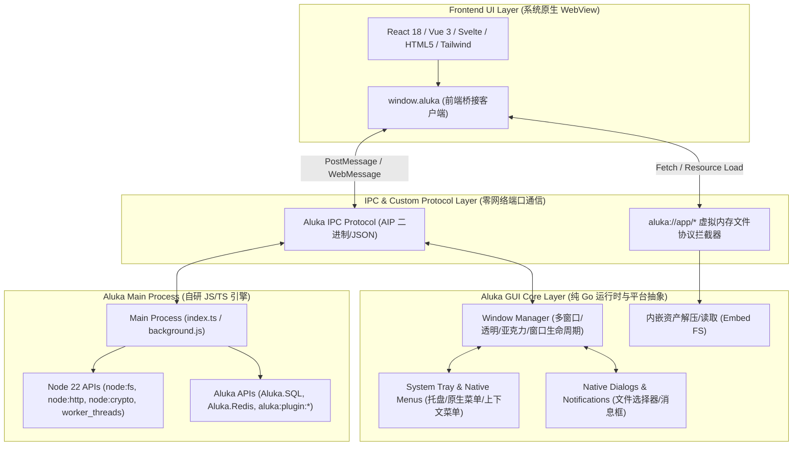

# Aluka GUI 架构设计方案（参考 Wails v3）

> **文档状态**：设计完成 / Phase GUI-1、GUI-2 已落地（Windows）
> **目标定位**：基于纯 Go 与自研 JS 引擎，构建比肩 Wails v3 / Tauri 2、开发体验超越 Electron 的**现代化轻量级全栈跨平台桌面应用开发框架**。

> **实现进度备注（2026-08）**：
> - ✅ 纯 Go WebView2 绑定（`internal/gui/webview2_windows.go`）：不依赖 WebView2Loader.dll / CGO，
>   直接经注册表定位运行时（`EBWebView\<arch>\EmbeddedBrowserWebView.dll`）并调用其内部导出
>   `CreateWebViewEnvironmentWithOptionsInternal`，全部 COM vtable 经 `syscall.SyscallN` 驱动；
> - ✅ 专用 UI 线程消息循环模型（窗口创建 / WebView2 挂载 / 任务投递全部收敛到 UI 线程，`PostThreadMessageW` 派发）；
> - ✅ `aluka://app/*` 虚拟协议经 `WebResourceRequested` 拦截（内部映射 `http://aluka.app/*` 以兼容全版本 SDK），零 TCP 端口；
> - ✅ 前端 `window.aluka` 桥接注入、WebMessage 双向通道、RPC 注册表、原生文件/消息对话框；
> - ✅ 生命周期：Controller/WebView/Environment 持 COM 引用（AddRef），跨线程销毁经 WM_CLOSE 路由；
> - ✅ 系统托盘实装（`tray_windows.go`：Shell_NotifyIconW + 共享消息窗口）与原生弹出菜单
>   （复选/禁用/分隔线/子菜单/JS click 回调）；
> - ✅ 全局快捷键（`shortcut*.go`：RegisterHotKey + 加速器解析，支持 Ctrl/Shift/Alt/Super 组合与
>   字母/数字/F1-F12/方向键等，跨平台注册表抽象，非 Windows 平台返回未支持）；
> - ✅ Windows 11 现代背景特效（Mica / Acrylic / MicaAlt，DWM `SYSTEMBACKDROP_TYPE`，旧系统静默忽略）
>   与 WebView2 透明背景（`put_DefaultBackgroundColor`）联动；
> - ✅ 窗口尺寸约束（WM_GETMINMAXINFO）与可调整大小切换（WS_THICKFRAME）；
> - ✅ `aluka build --gui` 单文件 GUI 打包：`--web-dir` 前端资源递归内嵌进 payload
>   （manifest.webAssets，base64+zlib），产物启动时挂载 `aluka://app/` 内存虚拟协议
>   并分离控制台（Windows 免黑框，`FreeConsole`）；`--icon` 应用图标双通道生效：
>   ① manifest.icon 运行时经 `CreateIconFromResourceEx` 应用于窗口标题栏/任务栏
>   （WM_SETICON）与默认托盘图标；② **PE 文件级 `.rsrc` 重写**（`compile.InjectIcon`：
>   保留 VERSIONINFO 等非图标资源、新数据追加至文件尾并改写节表/数据目录/
>   SizeOfImage），Explorer 中的 exe 图标即为应用图标；端到端验证：37MB 单文件 exe
>   加载内嵌页面 + 前端桥接回路全通 + shell 提取图标哈希与基座不同；
> - ⏳ 待办：macOS/Linux 平台层、Vibrancy（macOS）。

---

## 1. 架构愿景与竞品对比

### 1.1 为什么需要在 Aluka 中构建 GUI 体系？
目前主流的跨平台桌面技术方案各有痛点：
- **Electron**：捆绑完整的 Chromium + Node.js，打包产物动辄 150MB+，内存开销高（200MB~500MB 起步），启动慢；
- **Wails v3 / Tauri 2**：使用系统原生 WebView，产物轻量（10MB~30MB），但**后端与前端语言割裂**（Go/Rust 后端 + Web 前端），无法在主进程中直接运行现有的 Node.js/TypeScript 生态库；

### 1.2 竞品对比矩阵

| 维度 | Electron | Wails v3 | Tauri 2 | **Aluka GUI (本方案)** |
| :--- | :--- | :--- | :--- | :--- |
| **渲染内核** | 内嵌完整 Chromium | 操作系统原生 WebView | 操作系统原生 WebView | **操作系统原生 WebView (WebView2 / WKWebView / WebKitGTK)** |
| **主进程运行时** | Node.js (V8) | Go 编译二进制（无 JS 运行时） | Rust 编译二进制（无 JS 运行时） | **Aluka 自研 JS/TS 纯 Go 引擎（兼容 Bun/Node 22）** |
| **开发语言** | JS / TS | Go (后端) + JS (前端) | Rust (后端) + JS (前端) | **纯 JS / TS（前后端语言统一）或 Go 扩展** |
| **打本体积** | 120MB ~ 200MB+ | 15MB ~ 30MB | 10MB ~ 25MB | **25MB ~ 35MB（单二进制静态可执行文件）** |
| **启动时延** | 500ms ~ 1500ms | 30ms ~ 80ms | 30ms ~ 60ms | **< 40ms（JIT 预热 + 内存预编译字节码）** |
| **内存占用** | 180MB ~ 400MB | 30MB ~ 60MB | 25MB ~ 50MB | **30MB ~ 60MB** |
| **前端调用后端** | IPC (Electron IPC) | Go Bindings RPC | Rust Commands IPC | **透明 RPC / AIP 二进制 IPC / 内存直接直通** |
| **源码级 JSX/TSX** | 需 Webpack/Vite 预编译 | 需 Vite/前端打包器 | 需 Vite/前端打包器 | **Aluka 引擎原生即时转译，支持零配置即时启动** |

---

## 2. 总体分层架构

Aluka GUI 采用**双环驱动模型（Dual-Loop Architecture）**：
1. **主线程 OS GUI 消息循环（OS Message Loop）**：负责原生窗口创建、事件分发、WebView 消息泵（Message Pump）、系统托盘与原生菜单；
2. **Aluka 引擎执行线程（JS Engine Event Loop）**：负责执行主进程 TypeScript/JavaScript 业务逻辑、Node.js 内置模块、网络与数据库服务；
3. 两者通过 **Go Channel / 线程安全任务队列** 互通，彻底避免 UI 阻塞与死锁。



---

## 3. 核心子系统设计

### 3.1 跨平台原生 WebView 抽象层（`internal/gui/webview`）
纯 Go 实现，严格禁用 CGO，使用动态链接 / Syscall / COM 技术无缝对接各平台：
- **Windows**：通过 Win32 API 与 COM 接口调用 Microsoft Edge **WebView2**（支持 Windows 10/11，自带常驻运行时）；
- **macOS**：通过 `syscall` 与 Objective-C Runtime 动态绑定 **Cocoa / WKWebView**（原生支持 Metal 硬件加速与毛玻璃效果）；
- **Linux**：通过动态库调用 **WebKitGTK (libwebkit2gtk-4.0/4.1)**。

#### 窗口特性支持矩阵：
- ✅ **多窗口管理（Multi-Window）**：支持创建多个无限制的子窗口、模态窗口（Modal Window）、浮窗（Tool Window）；
- ✅ **现代视觉特效**：无边框窗口（Frameless）、亚克力模糊（Acrylic）、Windows 11 云母（Mica）、macOS 活力毛玻璃（Vibrancy）；
- ✅ **窗口几何与状态控制**：最小化、最大化、全屏（Fullscreen）、居中、置顶（AlwaysOnTop）、尺寸约束（Min/MaxSize）；
- ✅ **窗口拖拽区域（Frameless Dragging）**：通过在 HTML 元素添加 `data-aluka-drag` 或 CSS `-webkit-app-region: drag` 实现无边框原生拖拽。

---

### 3.2 零网络端口的自定义虚拟协议（`aluka://app/`）
传统 Electron / Web 应用经常通过在后台监听一个 HTTP 随机端口（如 `http://127.0.0.1:49152`）来加载前端页面，容易导致端口冲突、防火墙拦截以及本地安全漏洞。

**Aluka GUI 方案**：
- 注册平台级自定义 URI 方案（Custom URI Scheme）：`aluka://app/`；
- WebView 请求 `aluka://app/index.html` 或 `aluka://app/assets/app.js` 时：
  - 由 Go 核心层直接在内存中拦截（`WebResourceRequested` / `WKURLSchemeHandler`）；
  - 直接从打包嵌入的二进制数据或本地文件流式读取并返回正确的 MIME Type（`text/html`, `application/javascript`, `image/png`）；
  - **无需启动任何 TCP 端口，100% 免疫端口探测与跨站劫持，加载速度达到纯内存总线级别！**

---

### 3.3 前后端统一 JS API 设计（`Aluka.gui` / `aluka:gui`）

开发者可以在主进程脚本中像写现代 Node.js 一样自由调用桌面能力：

```ts
import { app, Window, Tray, Menu, dialog } from "aluka:gui";

// 1. 应用生命周期控制
app.on("ready", async () => {
  // 2. 创建现代化主窗口
  const win = new Window({
    title: "Aluka Studio",
    width: 1200,
    height: 800,
    minWidth: 800,
    minHeight: 600,
    frame: false,             // 无边框窗口
    transparent: true,         // 透明背景
    backgroundEffect: "mica",  // Windows 11 云母特效 (macOS 自动转为 vibrancy)
    url: "aluka://app/index.html", // 加载前端页面
    preload: "./preload.js",   // 预加载脚本
  });

  // 3. 创建系统托盘与托盘菜单
  const tray = new Tray({
    icon: "assets/icon.ico",
    tooltip: "Aluka Studio Running",
    menu: Menu.buildFromTemplate([
      { label: "显示主窗口", click: () => win.show() },
      { label: "配置项", click: () => openSettings() },
      { type: "separator" },
      { label: "退出应用", click: () => app.quit() }
    ])
  });

  // 4. 双向事件与 RPC 绑定
  win.on("close", (e) => {
    // 点击关闭时最小化到托盘
    e.preventDefault();
    win.hide();
  });
});
```

---

### 3.4 前端轻量注入与双向通信（`window.aluka`）

在 WebView 前端页面中，Aluka 自动注入全局对象 `window.aluka`：

```ts
// 1. 窗口控制
document.getElementById("btn-min").onclick = () => window.aluka.window.minimize();
document.getElementById("btn-max").onclick = () => window.aluka.window.toggleMaximize();
document.getElementById("btn-close").onclick = () => window.aluka.window.close();

// 2. 调用主进程 / 原生对话框
const files = await window.aluka.dialog.showOpenDialog({
  title: "选择工程目录",
  properties: ["openDirectory"]
});

// 3. 双向事件监听与广播
window.aluka.events.on("server_status", (data) => {
  console.log("Server CPU:", data.cpu);
});
window.aluka.events.emit("renderer_ready", { theme: "dark" });
```

---

## 4. 单二进制打包发布工作流（`aluka build --gui`）

Aluka 强大的自研单文件打包器（`aluka build --compile`）将直接支持 GUI 单文件打包：

```bash
# 一键将前端 Web 目录 + 主进程 TS 代码编译为单个 Windows .exe (含品牌图标与无控制台黑框)
aluka build --gui --compile \
  --entry ./src/main.ts \
  --web-dir ./dist \
  --icon ./assets/icon.ico \
  --outfile ./bin/AlukaStudio.exe
```

### 打包产物内部结构：
```
+-------------------------------------------------------------+
| Aluka 纯 Go 基座二进制 (含 WebView2/WKWebView 绑定与图标资源)   |
+-------------------------------------------------------------+
| 主进程预编译字节码 (main.ts.alukabc + 相关模块依赖图)             |
+-------------------------------------------------------------+
| 前端静态资源压缩包 (HTML / CSS / JS / 图片 / 字体 Embed FS)    |
+-------------------------------------------------------------+
| GUI Manifest 配置清单 (窗口默认配置、权限声明、URI 映射)        |
+-------------------------------------------------------------+
| Aluka 8 字节魔数尾部 (ALUKAPAYLOAD + 偏移量 + 校验码)          |
+-------------------------------------------------------------+
```
- **Windows 产物特性**：自动设置 PE 子系统为 `GUI`（`flags -H=windowsgui`），启动时**绝不弹出任何黑色 CMD 控制台窗口**；
- **自包含分发**：用户双击 `.exe` 立即由内存解压并挂载 `aluka://app/` 启动，零依赖即开即用！

---

## 5. 路线图与分阶段实施计划（Roadmap）

| 阶段 | 里程碑 | 核心目标与交付内容 |
| :--- | :--- | :--- |
| **Phase GUI-1** | **基座与 WebView 绑定** | 1. 纯 Go Windows WebView2 绑定；<br>2. `Window` 基础生命周期（创建/显示/尺寸/无边框/居中）；<br>3. `aluka://app/` 内存协议拦截。 |
| **Phase GUI-2** | **双向通信与 IPC 桥接** | 1. 前端 `window.aluka` 注入；<br>2. 主进程与渲染进程的双向 RPC 与 EventBus；<br>3. 原生文件对话框（`dialog.showOpenDialog`/`showSaveDialog`）。 |
| **Phase GUI-3** | **桌面特有生态完善** | 1. 系统托盘（`Tray`）与原生菜单（`Menu`）；<br>2. 全局快捷键（`globalShortcut`）；<br>3. 现代特效（Mica / Acrylic / Vibrancy / 窗口暗黑主题跟随）。 |
| **Phase GUI-4** | **单文件 GUI 打包器** | 1. `aluka build --gui` CLI 命令行集成；<br>2. 前端静态资源内嵌打包；<br>3. Windows / macOS / Linux 跨平台产物验证与全套 Demo 交付。 |

---

## 6. 总结

Aluka GUI 方案巧妙融合了 **Wails v3 的极致轻量原生 WebView 架构** 与 **Aluka 自身卓越的纯 Go JS/TS 运行时引擎**。它将彻底消除前后端语言分裂与 Electron 臃肿包袱，为前端与全栈开发者提供一个极致轻快、启动飞速、单二进制分发的下一代桌面应用开发利器！
