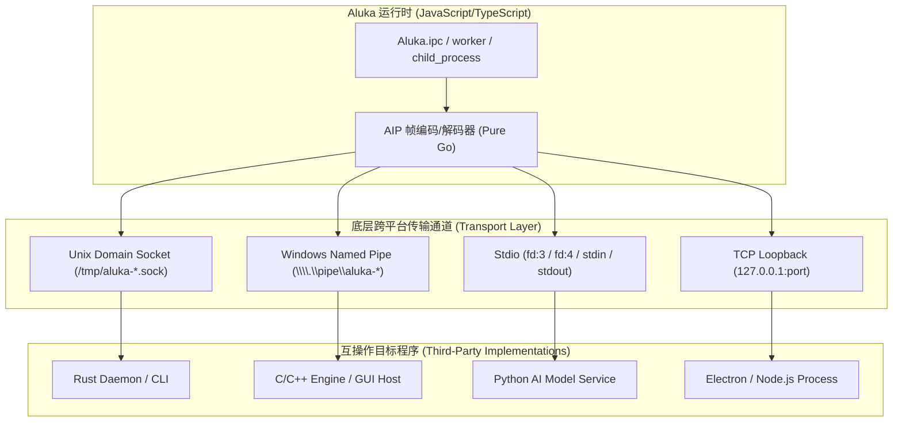
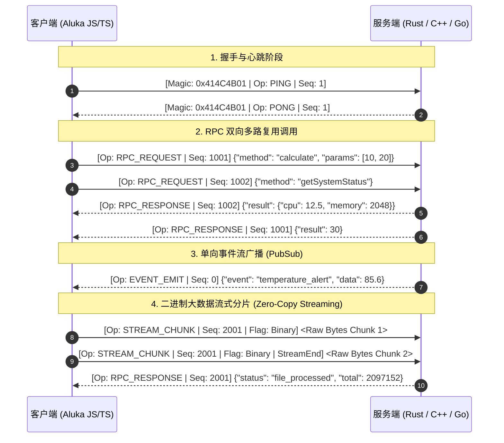

# Aluka 原生 IPC 通讯协议规范 (Aluka IPC Protocol - AIP)

> **版本**：1.0.0-draft  
> **设计目标**：高效、轻量、跨平台、全双工多路复用、支持大块数据零拷贝的高性能原生跨进程通信协议。

---

## 1. 架构总览与设计目标

Aluka 运行时需要与各类外部独立进程（例如：Electron 桌面主进程、C/C++ 原生插件/音视频引擎、Python AI 推理服务、Go 微服务、本地守护进程等）进行高频、低延迟、高并发的进程间交互。

传统 IPC（如 HTTP REST、标准 stdin/stdout 文本流或简单 JSON-RPC over TCP）存在以下局限：
1. **序列化开销大**：纯文本 JSON 处理大二进制块（图像、音视频、模型权重）时有 base64 膨胀或繁重字符转义开销；
2. **缺少多路复用**：简单管道无法单连接并发处理不同请求的乱序响应，易发生队头阻塞（Head-of-Line Blocking）；
3. **平台差异**：Windows 命名管道与 Unix 域套接字（UDS）系统 API 语义差异大。

**Aluka IPC Protocol (AIP)** 采用**定长二进制帧头（16 字节）+ 变长载荷（Payload）**的分层架构设计，天然支持双向 RPC、事件流广播与大二进制流零拷贝分片。



---

## 2. 传输层抽象 (Transport Layer)

AIP 支持四种底层全双工可靠传输介质：

| 传输模式 | 适用操作系统 | 典型应用场景 | 传输特性 |
| :--- | :--- | :--- | :--- |
| **Unix Domain Socket** | Linux, macOS, BSD | POSIX 架构原生 IPC | 零网络栈损耗，支持传递文件描述符（FD 传递） |
| **Named Pipe** | Windows (`\\.\pipe\name`) | Windows 原生跨进程 | 操作系统内核缓冲，支持非阻塞重叠 I/O (Overlapped I/O) |
| **Stdio Channel** | 全平台 (Windows/Linux/macOS) | 父子进程启动与托管模式 | 通过指定额外文件描述符（如 fd 3/4）或 stdin/stdout |
| **TCP Loopback** | 全平台 (127.0.0.1) | 容器间/沙箱网络隔离测试 | 通用网络互通，支持鉴权 token |

---

## 3. AIP 二进制帧格式 (Wire Framing Specification)

每个 AIP 数据包由 **16 字节定长帧头 (Header)** 与 **变长数据体 (Payload)** 组成。所有多字节整数一律采用**网络大端序 (Big-Endian)** 编码。

### 3.1 帧布局图 (16 Bytes Header)

```text
 0                   1                   2                   3
 0 1 2 3 4 5 6 7 8 9 0 1 2 3 4 5 6 7 8 9 0 1 2 3 4 5 6 7 8 9 0 1
+-+-+-+-+-+-+-+-+-+-+-+-+-+-+-+-+-+-+-+-+-+-+-+-+-+-+-+-+-+-+-+-+
|       Magic Number ('A', 'L', 'K', 0x01) -> 0x414C4B01       |
+-+-+-+-+-+-+-+-+-+-+-+-+-+-+-+-+-+-+-+-+-+-+-+-+-+-+-+-+-+-+-+-+
|    Version    |     Flags     |          Message Type         |
+-+-+-+-+-+-+-+-+-+-+-+-+-+-+-+-+-+-+-+-+-+-+-+-+-+-+-+-+-+-+-+-+
|                     Sequence / Request ID                     |
+-+-+-+-+-+-+-+-+-+-+-+-+-+-+-+-+-+-+-+-+-+-+-+-+-+-+-+-+-+-+-+-+
|                        Payload Length                         |
+-+-+-+-+-+-+-+-+-+-+-+-+-+-+-+-+-+-+-+-+-+-+-+-+-+-+-+-+-+-+-+-+
|                                                               |
+                        Payload Data ...                       +
|                       (Length: N Bytes)                       |
+-+-+-+-+-+-+-+-+-+-+-+-+-+-+-+-+-+-+-+-+-+-+-+-+-+-+-+-+-+-+-+-+
```

### 3.2 字段说明

1. **Magic Number (4 字节, uint32)**:
   - 固定值：`0x41 0x4C 0x4B 0x01`（ASCII `"ALK\x01"`）；
   - 用于协议识别与流式接收对齐校验，非此 Magic 立即断开连接。
2. **Version (1 字节, uint8)**:
   - 协议版本号，当前版本为 `0x01`。
3. **Flags (1 字节, uint8 位掩码)**:
   - `Bit 0 (0x01)`: **IsCompressed**（数据体已使用 Gzip/Deflate 压缩）；
   - `Bit 1 (0x02)`: **IsEncrypted**（数据体已使用 AES-GCM 端到端加密）；
   - `Bit 2 (0x04)`: **IsBinaryRaw**（数据体为原始二进制流，非 JSON 文本）；
   - `Bit 3 (0x08)`: **IsStreamEnd**（流式分片传输结束标识）；
   - `Bit 4-7`: 保留位（置 0）。
4. **Message Type / Opcode (2 字节, uint16)**:
   - `0x0001`: **PING**（心跳检测包，Payload 为 0 字节或毫秒时间戳）；
   - `0x0002`: **PONG**（心跳响应包）；
   - `0x0010`: **RPC_REQUEST**（方法调用请求，需对端回复相同 Sequence ID）；
   - `0x0011`: **RPC_RESPONSE**（方法调用成功响应）；
   - `0x0012`: **RPC_ERROR**（方法调用异常响应，包含错误码与错误信息）；
   - `0x0020`: **EVENT_EMIT**（单向事件广播 / PubSub，无需回包，Seq 可为 0）；
   - `0x0030`: **STREAM_CHUNK**（二进制/文本流分片数据）；
   - `0x00FF`: **DISCONNECT**（通知优雅下线）。
5. **Sequence / Request ID (4 字节, uint32)**:
   - 单调递增的请求序号（`1 ~ 4294967295`）；
   - 响应包（`RPC_RESPONSE` / `RPC_ERROR`）的 Sequence ID 必须与对应请求严格一致；
   - 允许单个物理连接上成千上万并发调用多路复用，消除队头阻塞。
6. **Payload Length (4 字节, uint32)**:
   - 紧随 Header 之后的数据体字节大小（`0 ~ 4,294,967,295` 字节）；
   - 单帧默认建议最大分片尺寸为 16MB（超过通过 `STREAM_CHUNK` 分包）。

---

## 4. 通信模式与交互生命周期



---

## 5. Aluka 运行时 API 设计 (`Aluka.ipc`)

在 JavaScript/TypeScript 运行时中提供简洁、现代的 Promise-based API：

```ts
// === 1. 服务端示例 (监听 IPC 连接) ===
import { ipc } from "aluka:ipc"; // 或 Aluka.ipc

const server = ipc.listen("/tmp/my-daemon.sock", {
  // 注册 RPC 处理函数
  methods: {
    add(a: number, b: number) {
      return a + b;
    },
    async queryUser(id: string) {
      return { id, name: "Alice", role: "admin" };
    }
  }
});

server.on("connect", (client) => {
  console.log("Client connected:", client.id);
  // 向客户端推送事件
  client.emit("welcome", { serverTime: Date.now() });
});

// === 2. 客户端示例 (发起连接与调用) ===
const client = await ipc.connect("/tmp/my-daemon.sock");

// 发起并发 RPC 调用
const sum = await client.call("add", [100, 200]); // 300
const user = await client.call("queryUser", ["u_1001"]);

// 监听服务端推送事件
client.on("welcome", (msg) => {
  console.log("Server welcomed us:", msg);
});

// 流式发送二进制大块 (比如图像或模型文件)
const stream = client.createStream("uploadModel");
stream.write(new Uint8Array(1024 * 1024)); // 1MB chunk
stream.end();
```

---

## 6. 第三方跨语言实现示例

得益于极简的 16 字节头部规范，任何语言都能在 100 行代码内实现编解码器。

### 6.1 Rust 结构体与解码器骨架
```rust
#[repr(C, packed)]
pub struct AipHeader {
    pub magic: u32,        // 0x414C4B01 (Big-Endian)
    pub version: u8,      // 0x01
    pub flags: u8,        // Bitflags
    pub msg_type: u16,     // Message Type Opcode
    pub seq_id: u32,       // Sequence ID
    pub payload_len: u32,  // Payload Size
}

impl AipHeader {
    pub const MAGIC: u32 = 0x414C4B01;
}
```

### 6.2 C/C++ 结构体定义
```c
#pragma pack(push, 1)
typedef struct {
    uint32_t magic;        // 0x414C4B01 (Big Endian)
    uint8_t  version;      // 0x01
    uint8_t  flags;        // Compression / Binary flags
    uint16_t msg_type;     // Opcode
    uint32_t seq_id;       // Request Sequence ID
    uint32_t payload_len;  // Length of following bytes
} AipHeader;
#pragma pack(pop)
```

### 6.3 Python 实现骨架
```python
import struct

AIP_HEADER_FORMAT = "!IBBHI"  # 16 Bytes Big-Endian
AIP_MAGIC = 0x414C4B01

def encode_aip_frame(msg_type: int, seq_id: int, payload: bytes, flags: int = 0) -> bytes:
    header = struct.pack("!IBBII", AIP_MAGIC, 1, flags, (msg_type << 16), seq_id) # 打包头部
    # ...
```

---

## 7. 异常处理与背压机制 (Reliability & Backpressure)

1. **粘包与半包处理**：
   - 传输层使用环形缓冲或流式累加器，确保每次先读满 16 字节 Header，再精准读取 `payload_len` 字节，杜绝粘包和内存越界；
2. **连接保活与超时 (Keepalive & Heartbeat)**：
   - 默认每隔 15 秒发送一次 `PING` 帧，对端立即回复 `PONG` 帧；若连续 3 次无响应，触发自动重连或释放套接字；
3. **背压控制 (Backpressure)**：
   - 当接收端消费速率低于发送端时，依靠底层操作系统管道/套接字内核缓冲区填满带来的阻塞/暂停机制，触发 JS 端的 `stream.pause()` / `stream.resume()`。

---

## 8. 下一步落地实施计划

- **Phase 1（核心协议库）**：实现 Go 原生 `internal/ipc/` 协议帧编解码器（`EncodeFrame` / `DecodeFrame` / `Transport`）与单元测试；
- **Phase 2（运行时绑定）**：在 `internal/runtime/globals/` 中注入 `Aluka.ipc` 模块（支持 UDS、Windows 命名管道与 Stdio）；
- **Phase 3（跨语言 Demo 与测试）**：提供 Rust / C / Python / Node.js 互通的综合 Conformance 差分测试套件。
